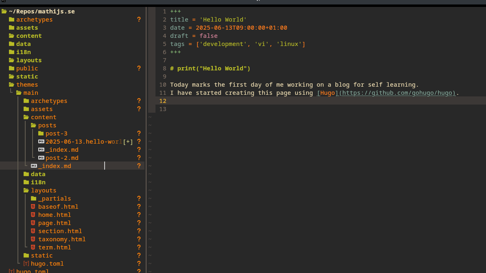

+++
title = 'print("Hello World")'
date = 2025-06-13T09:00:00+01:00
tags = ['ramble', 'vim']
image = { src =  'neovim-hello-world.png', alt= 'A screenshot of my NeoVim editor in Kitty terminal'}
summary = "Why I started a blog."
+++

Today I started work on my blog, 
the post you're reading has been written before the website is published.
I created this website so I could record my learnings more publicly,

I never liked sharing my opinion because of permanent Imposter Syndrome, but it is also a great way to reflect at times plus, it's kind of a fun pastime for me.
For this blog I have started using [Hugo](https://github.com/gohugo/hugo), which is a Go build static page generator.

*A screenshot of my NeoVim editor in Kitty terminal*

So what do I expected to write about:

- Small tech things I do, like today I have again configured my NeoVim setup, but this time, I'm actually using it.
- I want to start learning Computer Science. I did not study it, and I think I should.
- Technical Challenges, or fun encounters at work.
- The odd personal post, I don't like writing about myself but it could be nice to share some things.

