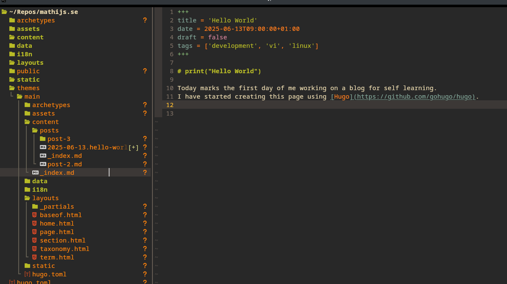

+++
title = 'print("Hello World")'
date = 2025-06-13T09:00:00+01:00
draft = false
tags = ['development', 'vim', 'linux', 'ramble']
image = { src =  'neovim-hello-world.png', alt= 'A screenshot of my NeoVim editor in Kitty terminal'}
+++

## Purpose of this journal

Today marks the first day of me working on a blog for self learning.
The purpose of this blog is to create a journal of learning or knowledge sharing,
likely for a very specific target audience or just for myself.
I have been working on professional software since 2009,
with a bit of a rocky start since I was a student for the first 6-7 of those years, more about that in the About section. I have a few things I would like to develop such as learning lower level languages like GO, Rust or C++.
I also find myself lacking of Computer Science as I studied Media Design I consider following [OSSU's online resources](https://github.com/ossu/computer-science), and blog about my learnings/experiences. 

## What did I do today

I have started creating this page using [Hugo](https://github.com/gohugo/hugo) since I like tooling that outputs simple static pages, as todays web is too bloated.
Simultaneously I have refreshed my Neovim setup, this is however a slightly modified config from [kickstart.nvim](https://github.com/nvim-lua/kickstart.nvim), which I can recommend for anyone vim-curious. I have been using vim keybinds since 2018 since being introduced to it by [@rickdgeerling](https://github.com/rickdgeerling) when I was working at Philips (Fun fact, Rick was hired as a consultant to replace me, I ended joining the same Consultancy).
Anyways, since I was relatively bored by the slow pace of Enterprise development, I started learning Vim bindings in VSCode using a plugin and now I can't type like a normal human bean anymore.
I have however, been coding mostly in IDE/Editors like VSCode and Visual Studio the last years.
At time of writing I still need to dive into Visual studio due to working with Blazor, which is poorly supported by other editors.

*A screenshot of my NeoVim editor in Kitty terminal*

Over the last years/decades I have made a few attempts to make a personal website/blog. 
The last time I had any websites live is over a decade ago when I was still working with PHP.
I have made many base web applications, in Angular (2 Alpha/Beta), React, Next.js but it never came to fruition, perhaps hugo will help ;-).
